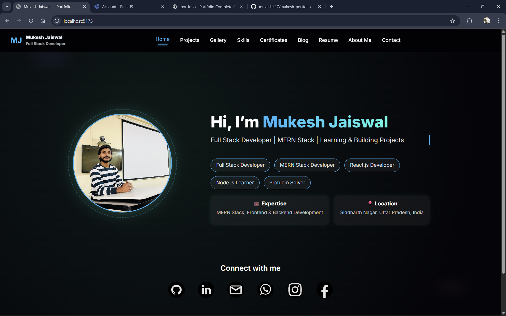
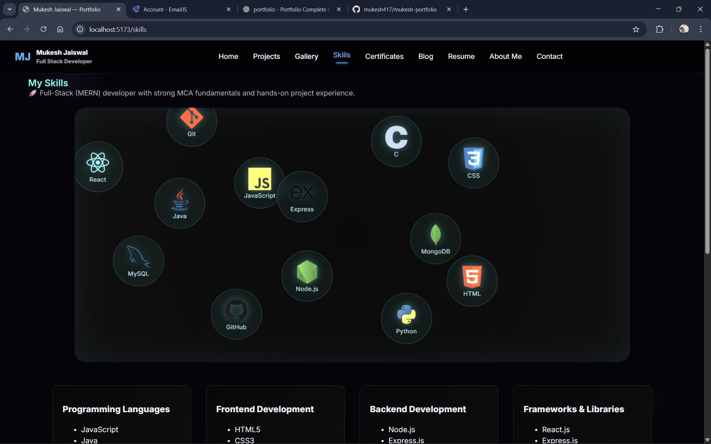
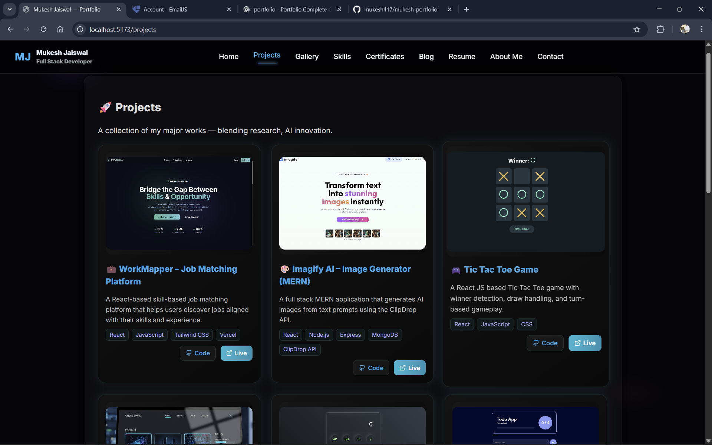
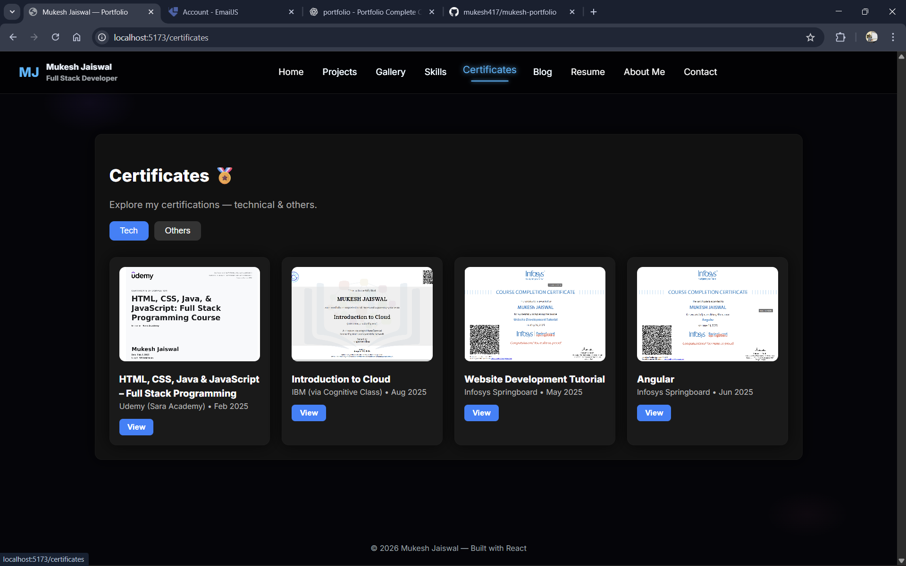

# 👨‍💻 Mukesh Jaiswal — Portfolio Website

Welcome to my personal portfolio website 🚀  
This portfolio showcases my skills, projects, certifications, and journey as an **MCA student & aspiring Full Stack (MERN) Developer**.

---

## 🌐 Live Portfolio
👉 https://mukesh-portfolio-sigma.vercel.app/

---

## 🧠 About Me
I am **Mukesh Jaiswal**, an MCA student passionate about building modern, responsive, and performance-optimized web applications.  
My goal is to grow as a **Full Stack Developer** and work on real-world impactful projects.

---

## 🛠️ Tech Stack
- ⚛️ React (Vite)
- 🎨 CSS / Tailwind CSS
- 🎬 Framer Motion
- 🧩 Lucide Icons
- 🌐 HTML5 & JavaScript
- 🔗 Git & GitHub

---

## 📂 Portfolio Sections
- Home
- About
- Skills
- Projects
- Certificates
- Gallery
- Blog
- Resume
- Contact

---

## 📸 Screenshots

### 🔹 Home Page


### 🔹 Skills Section


### 🔹 Projects Section


### 🔹 Certificates Section



---

## 🚀 Features
- Fully responsive design 📱💻
- Smooth animations using Framer Motion
- Clean & modern UI
- Component-based architecture
- Optimized for performance

---

## 📁 Project Setup (Local)
```bash
git clone https://github.com/mukesh417/mukesh-portfolio.git
cd mukesh-portfolio
npm install
npm run dev
